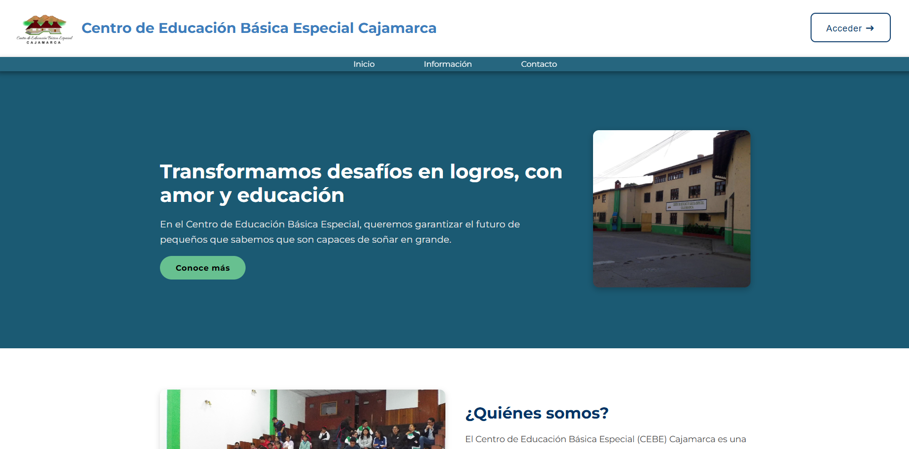
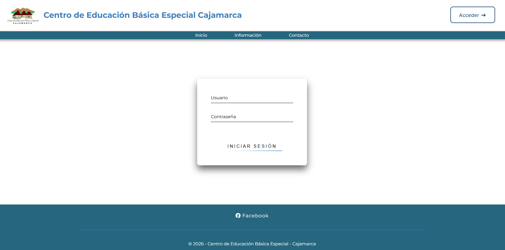
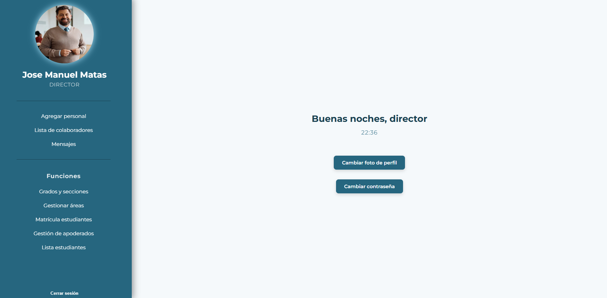
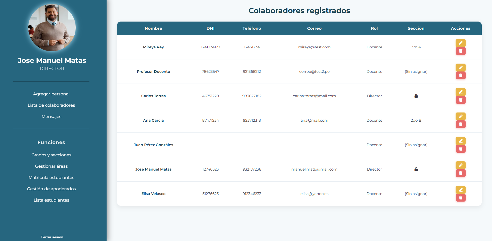
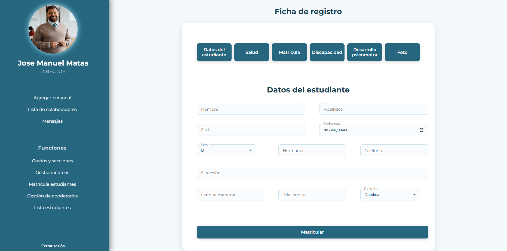
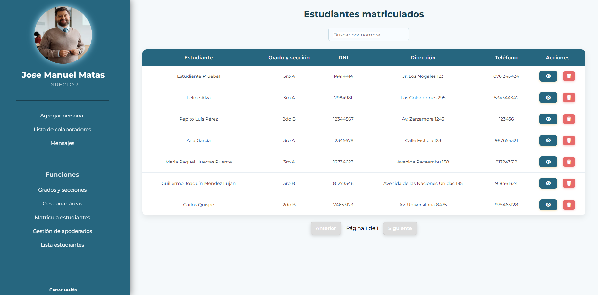
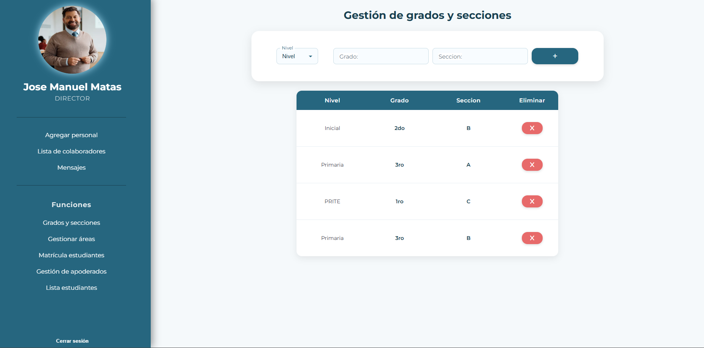
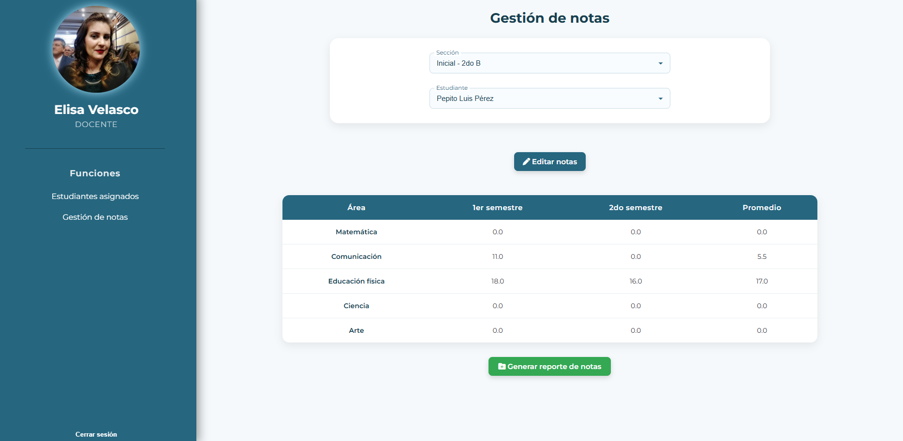

<h1>Educational Process Management System</h1>

<h2>[EN] Overview</h2>

This project presents the development of a web-based system designed to improve the management of educational processes in a special education institution.

The system aims to support digital transformation by replacing manual processes such as student registration, staff management, classroom assignment, and grading systems.

Additionally, the project evaluates the impact of this implementation through statistical analysis using the Wilcoxon signed-rank test.

<h2>[ES] Descripción</h2>

Este proyecto presenta el desarrollo de un sistema web orientado a mejorar la gestión de procesos educativos en un centro de educación básica especial.

El sistema permite digitalizar procesos manuales como:

<ul>
    <li>Registro de estudiantes</li>
    <li>Gestión de personal</li>
    <li>Asignación de aulas</li>
    <li>Registro de calificaciones</li>
</ul>

Además, se evalúa el impacto de la implementación mediante análisis estadístico inferencial utilizando la prueba de rangos con signo de Wilcoxon.

<h2>Technologies</h2>
<ul>
    <li>HTML, CSS, JavaScript</li>
    <li>Java</li>
    <li>SpringBoot</li>
    <li>MySQL</li>
    <li>MVC Architecture</li>
</ul>

<h2>Objectives</h2>
<ul>
    <li>Optimize administrative and academic processes</li>
    <li>Reduce manual workload</li>
    <li>Improve data organization and accessibility</li>
    <li>Measure the impact of digital transformation</li>
</ul>

<h2>Target users</h2>
<ul>
    <li>Administrative staff</li>
    <li>Academic staff (teachers)</li>
    <li>Institutional management</li>
</ul>

<h2>Results</h2>

The implementation showed a positive impact on process efficiency, validated through statistical analysis using the Wilcoxon signed-rank test.

<h2>Notes</h2>
<ul>
    <li>This repository excludes sensitive or real institutional data.</li>
    <li>Database scripts are provided for demonstration purposes only.</li>
</ul>

<h2>Screenshots</h2>

<h3>Landing_page</h3>

<h3>Login</h3>

<h3>Dashboard</h3>

<h3>Staff Management</h3>

<h3>Student Registration</h3>

<h3>Student Management</h3>

<h3>Classroom Management</h3>

<h3>Grading System</h3>

<h2>Author</h2>

<strong>Wolf Shadowflame (aka Nicolás Mendoza)</strong>

